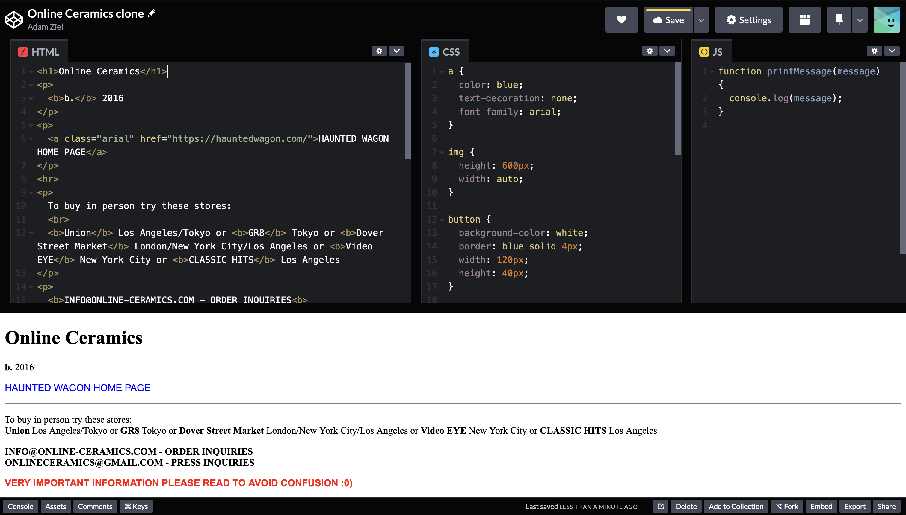

# VideoArchiveWorkshop

## About me

- I'm Adam, and got connected to LK through Em in Seattle
- I write image processing code for ultrasound machines at Philips Healthcare *(i.e. I'm familiar with code, but not with web development)
  *
- I started making websites in October when Em told me her dream of having an online archive for all of LK's work
- [www.adamziel.today](https://adamziel.today), email: adam@ziel.today
### 💀DISCLAIMER!💀 I'm really new to this, so take everything with a grain of salt! These are just the things I've found that work best for me :)

## Agenda
### 1. [Tour of LK archive website](#tour-of-lk-archive) [5 min]
### 2. [How we did it](#how-we-did-it) [15 min]
- Design decisions
- Tools we used
- Cost
### 3. [How to build a website from scratch](#building-a-website-from-scratch) [the rest]
- How to host a custom 'from scratch' website
- How to steal code
- How to write code

## Tour of LK archive
### Context
- Wanted a place to archive all the work that's been shown at in-person LK screenings over the years
- Experimental film libraries aren't super common, can be expensive to access

[www.linokinoarchive.com](https://www.linokinoarchive.com/)

## How we did it

### Design decisions

#### Building from scratch vs. Wordpress, Wix etc.
- I wanted full freedom + control since I'm already familiar with coding
- Wanted to avoid cookie cutter WordPress look, fighting with templates, paid features etc.
- Wanted the archive to be aesthetically simple to provide a neutral backdrop that'd fit everyone's video. *I.e. focus on providing information, avoid window dressing*

#### Self-hosting videos vs. embedding from YouTube/Vimeo
- Again, this gives us more freedom (e.g. YouTube copyright + terms of service)

### Tools
| Tool     | Description | $/month |
| ----------- | ----------- | ----------- |
| [Visual Studio Code](https://code.visualstudio.com/download) | *The editor where I write all my code* | Free |
| [GitHub](https://github.com/)| *Where I host the raw source code (similar to collaborative Google Docs)* | Free |
| [Google Domains](https://firebase.google.com/docs/hosting) | *Where I bought the domain* | $1 ($12/year) |
| [Google Firebase Hosting](https://firebase.google.com/docs/hosting) | *The backend where I host the website on the internet* | Free tier |
| [Google Firestore Database](https://cloud.google.com/firestore) | *The backend where I host the content database (e.g. artist + film info)* | Free tier |
| [Google Cloud Storage](https://cloud.google.com/storage) | *Where I host the actual video content (as opposed to embedding YouTube/Vimeo videos)* | $1.76 |
| | **Total** | $2.76 |

### Data flow

### Database layout
- Website content is dynamically loaded from the database
- This prevents us from having to write new code everytime we add a new artist or film

Shared 'keys' between database tables let us fluidly traverse between artists <--> films <--> programming

### Helpful learning resources
1. [Stack Overflow](https://stackoverflow.com/questions/114543/how-to-horizontally-center-an-element) - *The authoritative coding Q&A forum - usually the 1st site that will come up whenever you google a 'How do I do X?' coding question*
2. [W3School](https://www.w3schools.com/) - *Super clear tutorials for basic HTML, CSS, and Javascript stuff. It has really cool [Try it Yourself](https://www.w3schools.com/css/tryit.asp?filename=trycss_default) windows where you can live-edit sample code and then see what it does to the webpage in real-time*

## Building a website from scratch

### 1. Buy a domain
Some options:
- Google Domains
- GoDaddy
- Namecheap
- PorkBun

Shop around, prices usually vary a bit from site to site.

I use Google Domains just because a lot of my other tools are Google-based

### 2. Create a GitHub account and create a new repository
- This is where you'll track all the revisions of your code
- Think collaborative Google Drive
- Mutiple people can work on the same communal code repository, and have access to all the revision history
- No more AdamZielResume.pdf, AdamZielResume_1.pdf, AdamZielResume_Final.pdf etc.

Pick a name and whether you want it to be private or public:

### 3. Download Visual Studio Code and clone your GitHub repository
- This is where you'll write all the code for your site.
- It's just a fancy text editor that supports HTML, CSS, JavaScript etc.

### 4. Create a Google Firebase account and create a new project
- This is what will host your code from GitHub on the internet

### 5. Add Google Firebase to your Visual Studio Code Project

### 6. Direct your Firebase project to the domain name you bought
 
## How to steal code

Right-click a website and select 'Inspect' to see the source code:

Inspirations:
- [noamori.com](https://www.noamori.com/)
- [https://exp.paperdove.com/chillin/](https://exp.paperdove.com/chillin/)
- [https://furqanjawed.com/](https://furqanjawed.com/)

[stealing.rocks](https://www.stealing.rocks/)

## How to write code

As a simple example to cover a lot of the basics, lets build a clone of [www.online-ceramics.com](https://online-ceramics.com/)

You can follow along at [this link](https://codepen.io/adamziel/pen/dyZQavw)

